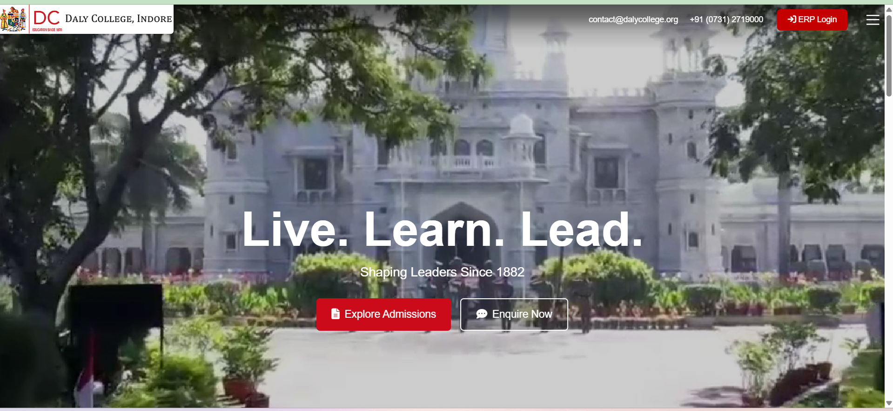
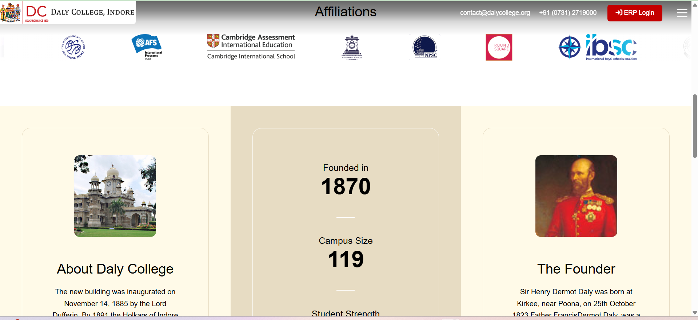

# 🎨 Figma to HTML Conversion (Web Development Assignment)

A professional front-end implementation of a Figma design, developed as part of an assignment from a web development company.
This project focuses on delivering a **pixel-perfect UI**, **fully responsive layout**, and **smooth interactive animations**.

---
## Live ✅ https://arko-009.github.io/Task-Clone1/
## 🖼️ Preview




---

## 🚀 Key Highlights

* 🎯 Pixel-perfect conversion from Figma design
* 📱 Fully responsive (desktop, tablet, mobile)
* 🎬 Smooth animations using GSAP
* 🔢 Dynamic count-up functionality
* ⚡ Clean and structured code
* 🎨 Accurate spacing, fonts, and color matching

---

## 🛠️ Tech Stack

* HTML5
* CSS3
* JavaScript
* GSAP (Animation Library)

---

## 🧠 What This Project Demonstrates

* Ability to convert design → real UI
* Strong understanding of responsive design
* Practical use of animation libraries (GSAP)
* Attention to detail (UI/UX accuracy)
* Real-world frontend development skills

---

## 📂 Project Structure

```id="fig123"
project/
│
├── screenshots/        # Desktop & mobile previews
├── assets/             # Images, fonts, etc.
├── index.html
├── style.css
├── script.js
└── README.md
```

---

## ▶️ How to Run

1. Clone the repository

```bash id="fig456"
git clone https://github.com/Arko-009/Task-Clone1.git
```

2. Open the folder

3. Run `index.html` in your browser

---

## 📌 Note

This project was created as part of a real-world assignment to demonstrate frontend development skills and attention to UI detail.

---

## 👨‍💻 Author

**Arko Bag**
🔗 https://github.com/Arko-009

---

⭐ If you find this project useful, consider giving it a star!
